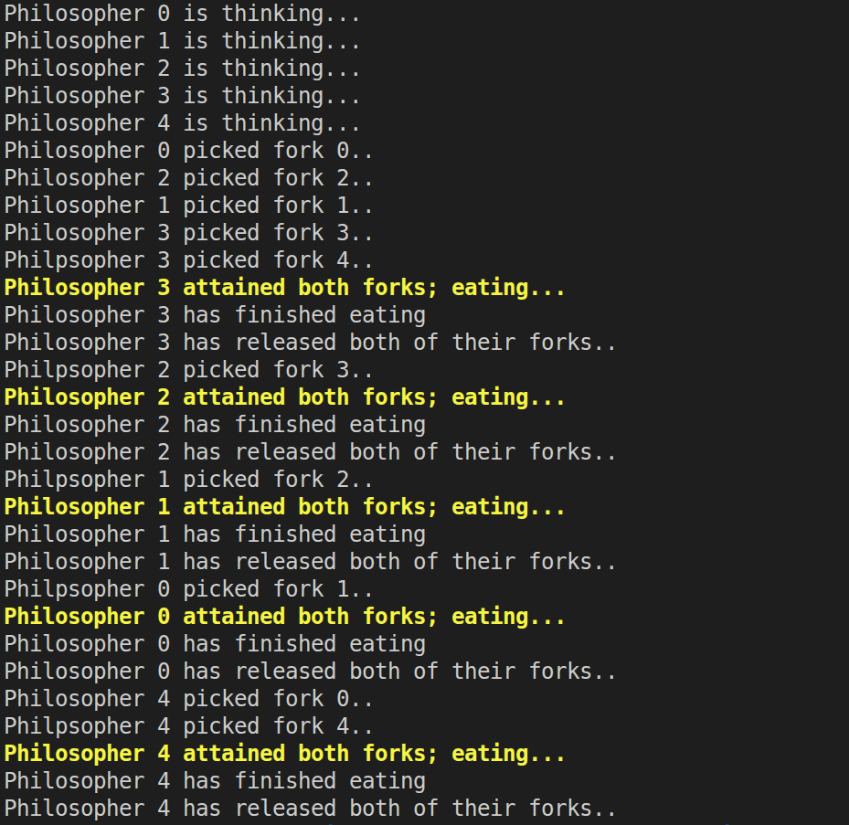

# Classical Problems of Process Synchronization
## 1. Dining Philosophers Problem
### Logic: Prevent Circular Wait Condition
```txt
    Let 4 philosophers take the left for and then take the right. 
    Let the 5th philosopher take the forks in reverse order
```
### Output: 

<div align="center">
    </img>
</div>